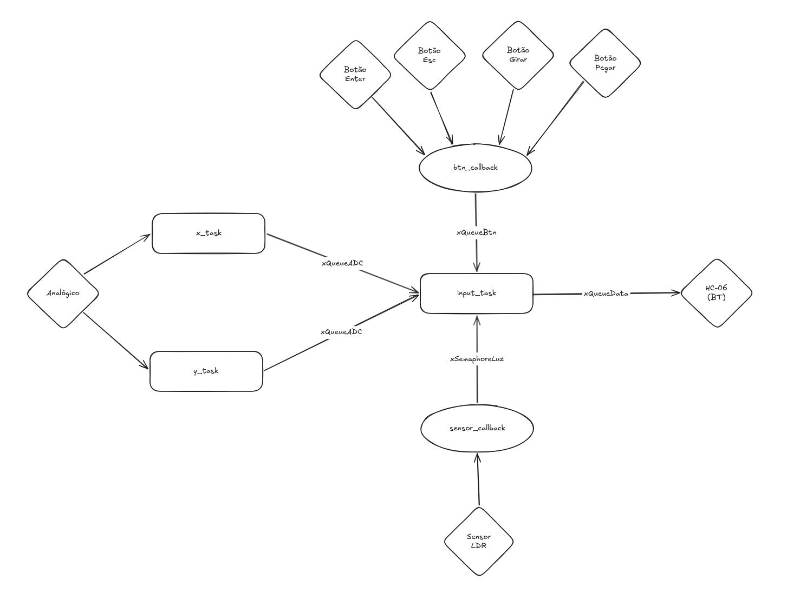

# Documentação da APS 2 de Embarcados

## Grupo

- Daniel Martins de Freitas
- Rafael Vieira Bravo

## Jogo escolhido 

Resident Evil 4 (Original)

## Ideia do projeto

Uma maleta (ou caixa) que, quando aberta abre o inventário do jogo.

Dentro da maleta vai ter um controle que pode ser usado para organizar o inventário. 

Quando a maleta é fechada, o inventário fecha.

## Inputs e Outputs

**Inputs**
- Sensor LDR
- Botões
- Joystick/thumbstick/D-Pad

**Outputs**
- Sensor Bluetooth (HC-06)

## Protocolo de comunicação utilizado

Vai ser enviado um conjunto de 4:
- Byte 1 e 2 - Indicam o comando que deve ser realizado no jogo
- Bytes 2 e 3 - End of Package

(Optamos por reutilizar a base do código do mouse no python)

### Bytes 1 e 2
* 00 - Não faz nada
* 01 - Abre o inventário (TAB)
* 02 - Move a seleção para cima
* 03 - Move a seleção para baixo
* 04 - Move a seleção para a direita
* 05 - Move a seleção para a esquerda
* 06 - Rotaciona o item selecionado, do contrário não faz nada (PgDown)
* 07 - Seleciona o item (Enter)
* 10 - Desseleciona o item (Esc)
* 11 - Pega o item selecionado (Backspace)

### Bytes 3 e 4 (End of Package)
42 42

## Diagrama de blocos

| Métrica / Task	| sensor_task |	x_task	| y_task	| input_task |
|:---| --- | --- | --- | ---: |
| WCET |	25.96 µs | 3.12  µs |	3.08 µs |	100.025 ms |
| Jitter | 49.781 ms | 1.331 µs |1.265 µs | 1.236 µ |
| Deadline Miss Rate	| 0 % | 0% |	0% |		0% |
| Stack Usage | 480 | 468| 468 | 472 |

como usamos o minimal config coloque o que sobrou

